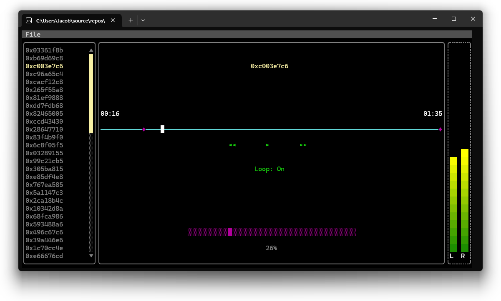
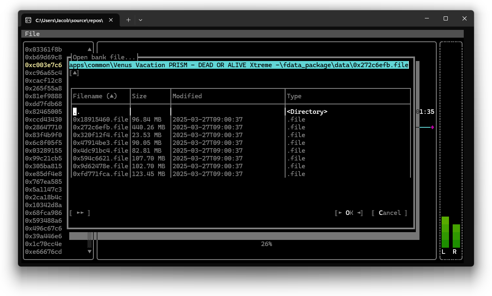

# PrismPlayer

Audio player built with [Terminal.Gui](https://github.com/gui-cs/Terminal.Gui) for listening to Venus Vacation PRISM and Xtreme Venus Vacation sound banks.



---

## System requirements
- [.NET Runtime 8.0](https://dotnet.microsoft.com/en-us/download/dotnet/8.0) or higher. Get the SDK instead if you intend to build the project.
- [Windows Terminal](https://github.com/microsoft/terminal) is recommended.
  The regular Windows Console Host does not support some glyphs and compatibility with
  other terminals and platforms have not been tested.

  ---

## Usage

### Running from the command line
#### PowerShell
```
.\PrismPlayer.exe <path_to_bank_file>
```
#### Command Prompt
```
PrismPlayer <path_to_bank_file>
```
If no arguments are passed, the program will still launch but you will
have to use the `File > Open bank file...` menu in the interface.


---

## Controls
Both keyboard and mouse input are supported.

- To open the File menu, press `Alt`+`F`.  
- Press `Tab` or the right arrow key to focus the next control.
- Press `Shift`+`Tab` or the left arrow key to focus the previous control.
- Press `Shift` with the left or right arrow keys to change the track bar value.

---

## Building

Clone the repository recursively.
```
git clone --recurse-submodules https://github.com/MarshmallowAndroid/PrismPlayer.git
```

Open `PrismPlayer.sln`, then build `PrismPlayer`.

---

## Todo

- [ ] Export support
- [ ] Improved keyboard shortcuts